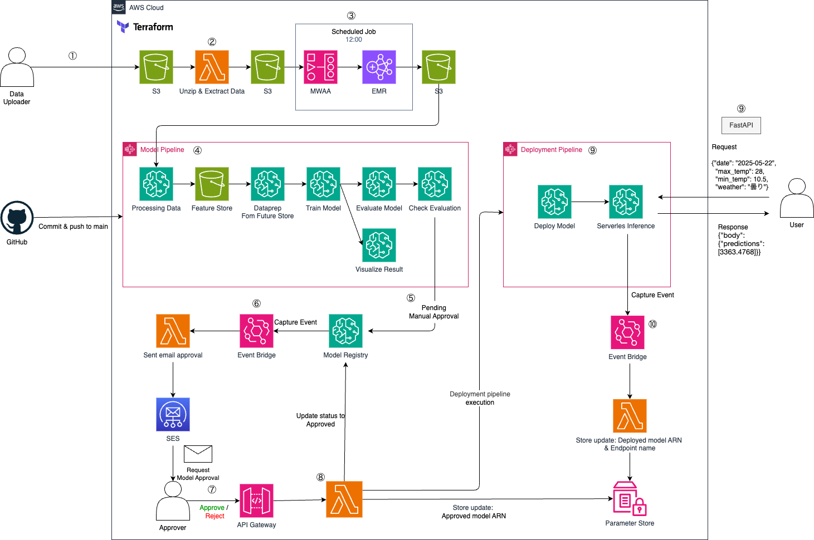
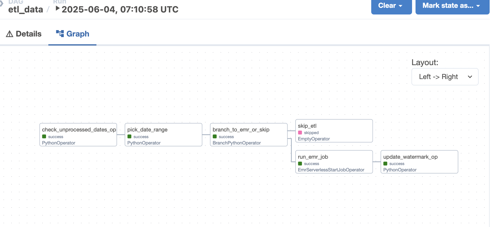
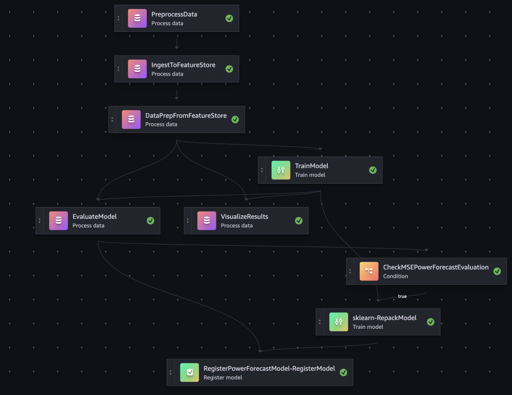
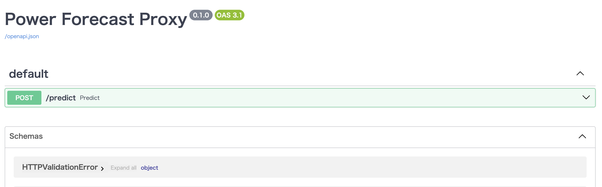
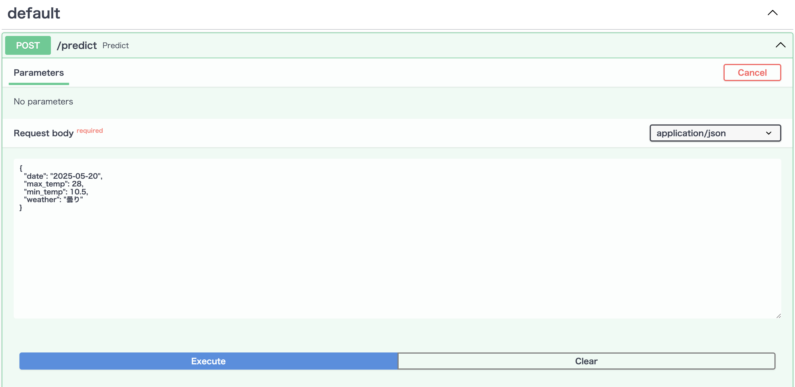
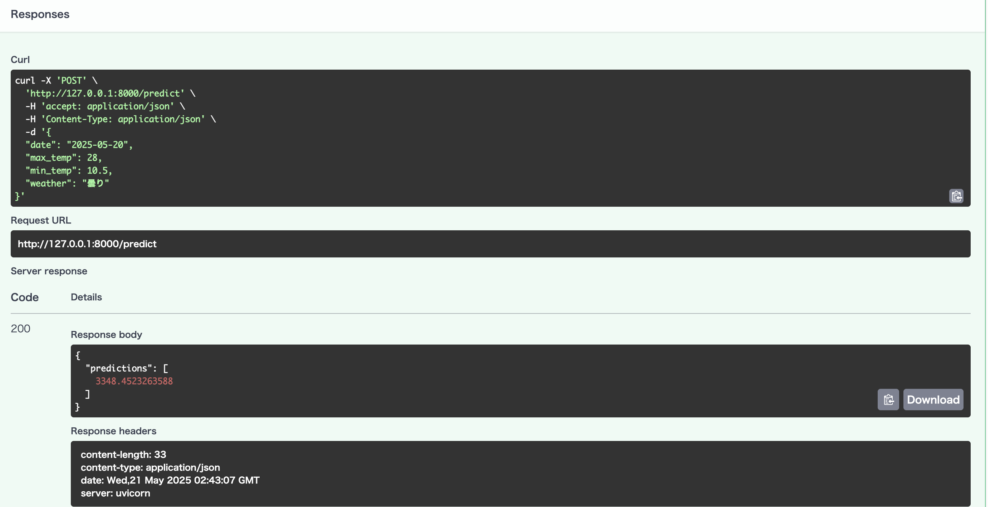

# Power-Forecasting-MLOps

## 概要

MLOpsの学習および実践を目的として、気象データと過去の電力使用実績を用いた機械学習モデルによる東京の電力需要予測パイプラインを構築しました。
前処理、学習、評価、可視化、モデル登録、デプロイといった一連のプロセスを AWS SageMaker Pipeline 上に構築し、データ・成果物の保存には S3、インフラの構成管理には Terraform を用いて、クラウドネイティブな MLOps 運用を一貫して自動化・管理しています。  
デプロイしたserverless inference のエンドポイントにアクセスすることで予測値を取得することができます。  

本プロジェクトでは、大規模データの処理を想定し、S3に保存されたデータに対して毎日12時にAWS MWAA上でSparkによるETL処理を実行しています。また、実験の柔軟性を高めるために、Feature Storeを導入し、特徴量の再利用性と一貫性を確保しています。([プロジェクトのシステム要件詳細](#プロジェクトのシステム要件シミュレーション概要))


## 使用データ

本プロジェクトでは以下のデータを利用しています：

1. **電力使用量データ**
   - 出典：東京電力パワーグリッド「でんき予報」過去実績データ
   - URL：https://www.tepco.co.jp/forecast/html/download-j.html
   - 期間：2022年4月～2024年12月
   - 内容：東京電力管内の日別電力使用量データ

2. **気象データ**
   - 出典：気象庁「過去の気象データ」
   - URL：https://www.data.jma.go.jp/stats/etrn/index.php?prec_no=44&block_no=47662
   - 観測地点：東京都-東京
   - 期間：2022年4月～2024年12月
   - 内容：日別の最高気温、最低気温、天気（晴れ、曇り、雨など）

## プロジェクトのシステム要件・シミュレーション概要

本プロジェクトは以下のような運用要件を想定しています。

**利用目的**  
 - 翌日の電力需要予測を行い、電力供給計画の最適化や異常検知に活用  

**利用者想定**  
 - 予測値を基に電力需給バランスを調整するオペレーター

**業務フロー**
 - 担当者が午前12時までに最新データを指定S3にアップロード
 - 12時にETL処理（Spark + MWAA）を実行し、データをクレンジング・結合
 - 14時にモデルパイプラインが自動起動し、学習・評価・可視化を実施
 - 精度が基準を満たすと承認プロセスを経て自動でエンドポイントにデプロイ
 - ユーザーはFastAPI経由で予測値を取得し、業務判断に活用

**スケーラビリティ要件**
 - 数年分を想定し、Spark + S3構成を選定
 - 再学習頻度は日次


## アーキテクチャ



### ワークフロー詳細
1. 担当者がS3ディレクトリにデータを保存する
2. Lamdaが起動し、zipファイルの解凍とデータの抽出を行う
3. 毎日12時にMWAA, EMR が起動し、データクレンジング・結合を行いS3へ保存する（MWAAの各タスクは[MWAA(Apache Airflow) 詳細](#mwaaapache-airflow-詳細)を参照）
4. 以下条件でModel Pipelineが起動し、特徴量エンジニアリング → Feature Storeへ保存 → エンコーディング・データ分割 → モデル学習 → 評価 → 可視化 → 閾値判定 までを自動で実行します  （各ステップの詳細は[パイプライン詳細](#パイプライン詳細)を参照）　　
    - 14時での自動実行
    - GitHub 上で対象ディレクトリに変更があり、main ブランチへマージされたとき（GitHub Actions 経由）
    - `run_pipeline.py` を手動で実行したとき
5. 評価メトリクスが指定閾値を満たしたモデルは、Model Registry に `PendingManualApproval` 状態で登録されます
6. EventBridge が `PendingManualApproval` のモデル登録イベントを検知し、承認用リンクを含む Eメールを SES 経由で送信する Lambda をトリガーします
7. 承認者はメール内の `Approve` または `Reject` をクリックします
8.  API Gateway が Lambda を呼び出し、次の処理が行われます
    - Model Registry 内のステータスを `Approved` または `Rejected` に更新
    - `Approved` の場合、そのモデルの ARN を Parameter Store に保存
    - `Approved` の場合、Deployment Pipeline を起動
9.  Deployment Pipeline が `Approved` モデルを Serverless Inference にデプロイします
10. デプロイ完了後、EventBridge が成功イベントを検知し、Parameter Store に以下を保存します
    - モデル ARN
    - エンドポイント名
11. ユーザーはエンドポイントに対してAPIリクエストを送信し、推論結果を取得することができます

### 特徴量エンジニアリング設計について

本プロジェクトでは、特徴量エンジニアリングのステップを SageMaker Pipelines の一部として構成しています。
- 複雑な if-else や祝日判定・天気分類などは pandas を用いて実装
- データ量が現状小規模なため、分散処理（Spark）は導入していませんが、構成としては SparkProcessor や EMR Step に置き換え可能
- OHE などのモデル依存の処理は学習ステップで実施し、推論時にも再利用可能なように encoder を保存

## MWAA(Apache Airflow) 詳細



| タスク                       | 内容                                                                                                                                          |
| :--------------------------- | :-------------------------------------------------------------------------------------------------------------------------------------------- |
| `check_unprocessed_dates_op` | S3バケット内のraw_power_usageとraw_weather_dataディレクトリから日付をリストを抽出し、DynamoDBに保存されている最後の処理日より新しい日付を返す |
| `pick_date_range`            | "YYYY-MM-DD, YYYY-MM-DD, ..."の文字列形式で未処理の日付を返す                                                                                 |
| `branch_to_emr_or_skip`      | 未処理の日付がある場合はEMRジョブを実行し、ない場合はスキップする                                                                             |
| `skip_etl`                   | 処理をスキップ                                                                                                                                |
| `run_emr_job`                | 日付毎にデータのクレンジング、結合、保存里処理を実行する                                                                                      |
| `update_watermark_op`        | 処理をした最後の日付をDynamoDBへ保存する                                                                                                      |


## パイプライン詳細



| ステップ                                   | 内容                                           |
| :----------------------------------------- | :--------------------------------------------- |
| `PreprocessData`                           | 特徴量エンジニアリング                         |
| `IngestToFeatureStore`                     | Feature Store へ登録                           |
| `DataPrepFromFeatureStore`                 | Feature Store からデータ取得、エンコーディング |
| `TrainModel`                               | モデル学習                                     |
| `VisualizeResults`                         | モデル性能・変数重要度などの可視化             |
| `EvaluateModel`                            | モデル評価                                     |
| `CheckMSEPowerForecastEvaluation`          | モデル性能の確認                               |
| `sklearn-RepackModel`                      | 推論できる形式に再パッケージ                   |
| `RegisterPowerForecastModel-RegisterModel` | モデルの登録                                   |


## ディレクトリ構成

| ディレクトリ/ファイル | 内容                                       |
| :-------------------- | :----------------------------------------- |
| `.github/`            | ワークフロー定義（CI）                     |
| `dags/`               | MWAA での DAG 定義                         |
| `inference_api/`      | 推論API                                    |
| `notebooks/`          | 実験で使用したnotebook                     |
| `src/`                | 前処理・学習・評価・推論などのステップ定義 |
| `pipeline/`           | パイプライン定義・実行                     |
| `terraform/`          | AWSインフラ構成                            |
| `lambda/`             | Lambda関数（自動承認・通知等）             |
| `test/`               | テストコード                               |
| `pyproject.toml`      | Pythonプロジェクト管理（Poetry）           |
| `makefile`            | 各種コマンド自動化（ruff, terraform）      |


## 主要ファイル・機能

| ファイル名                                            | 役割                                           |
| :---------------------------------------------------- | :--------------------------------------------- |
| `dags/dags.py`                                        | MWAA での DAG 定義                             |
| `src/preprocess.py`                                   | 特徴量エンジニアリング（エンコーディング除く） |
| `src/ingest_feature_store.py`                         | Feature Store へ登録                           |
| `src/dataprep_from_future_store.py`                   | エンコーディング、データスプリット             |
| `src/evaluate.py`                                     | モデル評価                                     |
| `src/visualization.py`                                | 結果可視化                                     |
| `pipeline/deployment_pipeline/deployment_pipeline.py` | デプロイパイプライン定義                       |
| `pipeline/model_pipeline/run_pipeline.py`             | 一連のパイプライン実行                         |
| `pipeline/model_pipeline/model_pipeline.py`           | モデルパイプライン定義                         |
| `terraform/`                                          | AWSリソース管理（S3, IAM, EventBridge等）      |
| `lambda/`                                             | Lambda関数                                     |
| `inference_api/`                                      | FastAPIの処理                                  |


## セットアップ

```
:warning:  以下は macOS を前提に書いています。
```

1. aws cli のインストール & configure に `access_key` と `secret_key` を設定  
 - 参考；[【AWS】aws cliの設定方法](https://zenn.dev/akkie1030/articles/aws-cli-setup-tutorial)

2. terraform のインストール  
 - 参考：[最新Mac対応】M1、M2、M3チップでTerraformをわずか3分でインストール！](https://zenn.dev/take_tech/articles/32188cd3607721)

3. 依存パッケージのインストール  
仮想環境化でのインストールを推奨します。
```sh
poetry install
```
4. メール設定  
モデルの承認はメールで承認することでデプロイ処理に進みます。  
メール送信はawsのSESを使用しているため、事前にコンソール上で設定を行ってください。  
なお、IDの設定は動作確認のためであればドメイン登録は不要です。eメール設定で自分のアドレスを認証させればサンドボックス環境下でも自分のメールアドレスに届きます。（自分の場合は迷惑メールに入っていました）  
terraformでも設定できると思いますが、今回はコンソール上でやってしまいました。。  
参考：
- [AWS-E メールの認証方法](https://docs.aws.amazon.com/ja_jp/ses/latest/dg/email-authentication-methods.html)
- [何もかもわからない人間によるAmazon SESメールのドメイン認証学習記録](https://qiita.com/ryo_one/items/c0135e43ca809e9f64f2)（もっと知りたい人）
5. terraform の実行  
以下コマンドで terraform を適用してください。
また、workspaceを使用しているのでworkspaceも設定します
```sh
cd terraform
terraform workspace new dev # workspace の作成（例としてdevで作成）
terraform workspace list # list コマンドで確認
terraform workspace select default # 必要であれば切り替え
terrafrom init
terraform plan # 適用内容の確認
terraform apply # 適用
```
S3バケットは同じ名前で作成できないかもしれません。。。  
その場合`terraform/modules/s3/buckets.tf`のbucketでバケット名を変更してください。また、以降のバケット箇所は読み替えて実施してください。  

**※MWAA関連は高コストなので`terraform apply`ではMWAA関連の環境は構築されないようになっています。MWAA含めて構築する場合は`terraform apply -var="enable_nat_gateway=true"`で実行してください**
NAT Gateway や Elastic IPS は常に課金されるので使用後は以下で削除することを推奨
```
terraform destroy \
  -target=module.network.aws_eip.nat_gateway_elastic_ips \
  -target=module.network.aws_nat_gateway.nat_gateways \
  -target=module.mwaa
```


6. 学習で使用するデータをS3に保存  
特に設定を変えていない場合はダウンロードしたデータを`power-forecasting-mlops-dev>data`に以下を保存
- power_usageのディレクトリを作成し、中に`202204_power_usage.zip` ~ `202412_power_usage.zip`
- `weather_data.csv`

7. MWAAで使用するスクリプトをS3に保存  
 - mwaa-〇〇バケットに`dags/`のrequirements.txtを配置、dagsディレクトリを作成し`dags/`の以下ファイルを配置
   - `__init__.py`
   - `check_unprocessed_dates.py`
   - `dags.py`
 - power-forecasting-emr-scripts-devバケットに`dags/`の以下ファイルを配置
   - etl_data.py
   - startup.sh


## ユースケース

このプロジェクトでは make ファイルを作成していますが、一部対応できていない箇所もあります。  

### ruff を実行したい
```sh
make lint
make fmt
make all # fmt + lint
```
上記でそれぞれ実行することができます。  
デフォルトでfmtを行うことでlintも実行しているっぽいのでfmtだけで十分な気がしています。。

### lambda を追加したいのでzipファイルを追加したい
```sh
zip_lambda file={ファイル名} # 拡張子は不要です
```
上記コマンドでlambdaディレクトリにあるpythonファイルを同じディレクトリにzipファイルが作成されます。（ファイル名は同じ）  
あとはlambda関連の terraform の設定を記述して、apply を実行してください。

### MWAA を実行したい
 - terraformで MWAA の環境が作成されていることを確認してください
 - 対象ファイルがS3の`power-forecasting-raw-data-dev`に以下のように保存されていることを確認してください
   - power_usage
     -  s3://power-forecasting-raw-data-dev/power_usage/202204_power_usage.zip
     - s3://power-forecasting-raw-data-dev/power_usage/202205_power_usage.zip 
   - weather_data
     - s3://power-forecasting-raw-data-dev/weather_data/weather_data.csv

[MWAA コンソール](https://ap-northeast-1.console.aws.amazon.com/mwaa/home?region=ap-northeast-1#home?landingPageCheck=1)から行ける Air Flow のUI上で対象のDAG(`etl_data`)を手動実行できます。もしくは環境が構築されていれば12時に自動実行されます。  
実行が成功すると`power-forecasting-processed-data-dev`に処理後のデータがあることを確認できます。

### model pipelieを実行したい
```sh
make model_pipeline
```
 -> aws sagemaker コンソールでpipelineが動作していることを確認してください

### deployment pipeline を更新したい
```sh
make deployment_pipeline
```
deployment pipelineはメール承認をトリガーに発火するため実行はここではされません。  
`make deployment_pipeline`で変更した実行されるpipelineの定義を更新することができます。  

deployment_pipelineでは新たにパッケージをinstallする必要があるためzipファイルをlambdaに渡しています。  
そのため`deploy_step.py`を変更してdeployment_pipelineを更新する場合は以下の処理を行う必要があります。
```sh
cd pipeline/deployment_pipeline
mkdir package
pip install --target ./package pytz # 必要なライブラリのインストール（例: pytz）
zip deploy_step.zip deploy_step.py # deploy_step.py を zip にする
cd package && zip -r ../deploy_step.zip ./* # packageの中身を追加
cd .. && unzip -t deploy_step.zip # zipの中身を確認
```
unzipしたときにdeploy_step.pyと各ライブラリが同じディレクトリに入っていればOK。  
package/ライブラリ のようにライブラリが入っているとエラーになるので注意。

参考：[PythonLambda関数で.zipファイルアーカイブを使用する](https://docs.aws.amazon.com/ja_jp/lambda/latest/dg/python-package.html)

### 予測値を取得してみたい
事前にmodel_pipelineを実行 -> メール承認 まで行いserverless inferenceにデプロイしてエンドポイントが作成されていることを確認してください。  
環境変数`ENDPOINT_NAME`にエンドポイント名を追加して適用してください。
確認後以下を実行
```sh
make run_api
```
コンソールに表示される`http://127.0.0.1:8000` に /docs を追加した `http://127.0.0.1:8000/docs` にアクセスする。  


`post /predict`をクリックし、右にある`Try it out`をクリック  
Request body にはデフォルト値が入っているのでそのまま`Execute`をクリック



Response が表示されpredictionsに予測値が入っていれば成功です。
今回デプロイしている serverless inference は常時稼働しているわけではないコールドスタートなので初回は時間がかかります。  



### APIエンドポイントの詳細

#### POST /predict
電力需要を予測するエンドポイント

**リクエスト本文**:
```json
{
  "date": "2025-05-20",
  "max_temp": 28,
  "min_temp": 10.5,
  "weather": "曇り"
}
```

**パラメータ説明**:
- `date`: 予測する日付（YYYY-MM-DD形式）
- `max_temp`: 最高気温（℃）
- `min_temp`: 最低気温（℃）
- `weather`: 天気

**レスポンス**:
```json
{
    "body": {
        "predictions": [
            3363.476878359826
        ]
    },
    "contentType": "application/json",
    "invokedProductionVariant": "AllTraffic"
}
```


## 今後の展望

### 1.  監視・通知機能の追加
- パイプライン失敗時やモデル精度劣化時にSlackで通知
- モデル精度やデータドリフトの継続的モニタリング（SageMaker Model Monitor）

### 2.  コスト最適化（FinOps）
- S3やログのライフサイクル設定などのストレージコスト最適化

### 3. 環境分離
- dev/prod などの環境ごとにバケット・エンドポイントを切り替える仕組みの導入する

### 4. CI/CD パイプラインの拡張
- 本番環境へのデプロイ自動化


## ライセンス

このプロジェクトは[Apache 2.0](LICENSE)の下で公開されています.
