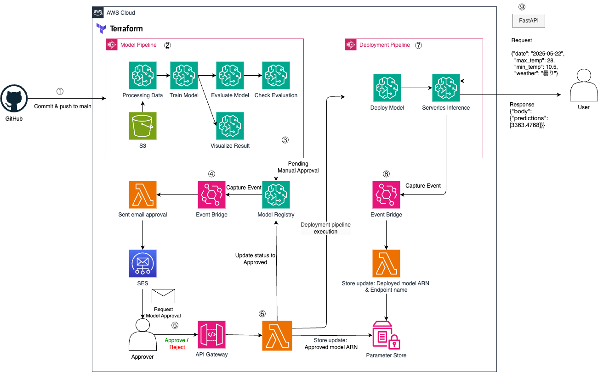

# Power-Forecasting-MLOps

## 概要

MLOpsの学習および実践を目的として、気象データと過去の電力使用実績を用いた機械学習モデルによる東京の電力需要予測パイプラインを構築しました。
前処理、学習、評価、可視化、モデル登録、デプロイといった一連のプロセスを AWS SageMaker Pipeline 上に構築し、データ・成果物の保存には S3、インフラの構成管理には Terraform を用いて、クラウドネイティブな MLOps 運用を一貫して自動化・管理しています。  
デプロイしたserverless inference のエンドポイントにアクセスすることで予測値を取得することができます。  

## 使用データ

本プロジェクトでは以下のデータを利用しています：

1. **電力使用量データ**
   - 出典：東京電力パワーグリッド「でんき予報」過去実績データ
   - URL：https://www.tepco.co.jp/forecast/html/download-j.html
   - 期間：2022年4月～2024年12月
   - 内容：東京電力管内の日別電力使用量データ

2. **気象データ**
   - 出典：気象庁「過去の気象データ」
   - URL：https://www.data.jma.go.jp/stats/etrn/index.php?prec_no=44&block_no=47662
   - 観測地点：東京都-東京
   - 期間：2022年4月～2024年12月
   - 内容：日別の最高気温、最低気温、天気（晴れ、曇り、雨など）


## アーキテクチャ




## パイプライン詳細


| ステップ                                   | 内容                               |
| :----------------------------------------- | :--------------------------------- |
| `LoadData`                                 | データのロード                     |
| `PreprocessData`                           | 前処理・特徴量エンジニアリング     |
| `TrainModel`                               | モデル学習                         |
| `VisualizeResults`                         | モデル性能・変数重要度などの可視化 |
| `EvaluateModel`                            | モデル評価                         |
| `CheckMSEPowerForecastEvaluation`          | モデル性能の確認                   |
| `sklearn-RepackModel`                      | 推論できる形式に再パッケージ       |
| `RegisterPowerForecastModel-RegisterModel` | モデルの登録                       |


## ディレクトリ構成

| ディレクトリ/ファイル | 内容                                       |
| :-------------------- | :----------------------------------------- |
| `.github/`            | ワークフロー定義（CI）                     |
| `data/`               | 入力データ（ローカル使用時）               |
| `inference_api/`      | 推論API                                    |
| `src/`                | 前処理・学習・評価・推論などのステップ定義 |
| `pipeline/`           | パイプライン定義・実行                     |
| `terraform/`          | AWSインフラ構成                            |
| `lambda/`             | Lambda関数（自動承認・通知等）             |
| `test/`               | テストコード                               |
| `pyproject.toml`      | Pythonプロジェクト管理（Poetry）           |
| `makefile`            | 各種コマンド自動化（ruff, terraform）      |


## 主要ファイル・機能

| ファイル名                                            | 役割                                      |
| :---------------------------------------------------- | :---------------------------------------- |
| `data/weather_data.csv`                               | 気象データ                                |
| `data/power_usage/`                                   | 月別電力使用量データ                      |
| `src/preprocess.py`                                   | データ前処理                              |
| `src/feature_encoder.py`                              | 特徴量エンジニアリング（エンコード）      |
| `src/evaluate.py`                                     | モデル評価                                |
| `src/visualization.py`                                | 結果可視化                                |
| `pipeline/deployment_pipeline/deployment_pipeline.py` | デプロイパイプライン定義                  |
| `pipeline/model_pipeline/run_pipeline.py`             | 一連のパイプライン実行                    |
| `pipeline/model_pipeline/model_pipeline.py`           | モデルパイプライン定義                    |
| `terraform/`                                          | AWSリソース管理（S3, IAM, EventBridge等） |
| `lambda/`                                             | Lambda関数                                |


## セットアップ

```
:warning:  以下は macOS を前提に書いています。
```

1. aws cli のインストール & configure に `access_key` と `secret_key` を設定  
 - 参考；[【AWS】aws cliの設定方法](https://zenn.dev/akkie1030/articles/aws-cli-setup-tutorial)

2. terraform のインストール  
 - 参考：[最新Mac対応】M1、M2、M3チップでTerraformをわずか3分でインストール！](https://zenn.dev/take_tech/articles/32188cd3607721)

3. 依存パッケージのインストール  
仮想環境化でのインストールを推奨します。
```sh
poetry install
```
4. メール設定  
モデルの承認はメールで承認することでデプロイ処理に進みます。  
メール送信はawsのSESを使用しているため、事前にコンソール上で設定を行ってください。  
なお、IDの設定は動作確認のためであればドメイン登録は不要です。eメール設定で自分のアドレスを認証させればサンドボックス環境下でも自分のメールアドレスに届きます。（自分の場合は迷惑メールに入っていました）  
terraformでも設定できると思いますが、今回はコンソール上でやってしまいました。。
参考：
- [AWS-E メールの認証方法](https://docs.aws.amazon.com/ja_jp/ses/latest/dg/email-authentication-methods.html)
- [何もかもわからない人間によるAmazon SESメールのドメイン認証学習記録](https://qiita.com/ryo_one/items/c0135e43ca809e9f64f2)（もっと知りたい人）
5. terraform の実行  
以下コマンドで terraform を適用してください。
また、workspaceを使用しているのでworkspaceも設定します
```sh
cd terraform
terraform workspace new dev # workspace の作成（例としてdevで作成）
terraform workspace list # list コマンドで確認
terraform workspace select default # 必要であれば切り替え
terrafrom init
terraform plan # 適用内容の確認
terraform apply # 適用
```
6. 学習で使用するデータをS3に保存  
特に設定を変えていない場合はダウンロードしたデータを`power-forecasting-mlops-dev>data`に以下を保存
- power_usageのディレクトリを作成し、中に`202204_power_usage.zip` ~ `202412_power_usage.zip`
- `weather_data.csv`


## ユースケース

このプロジェクトでは make ファイルを作成していますが、一部対応できていない箇所もあります。  

### ruff を実行したい
```sh
make lint
make fmt
make all # fmt + lint
```
上記でそれぞれ実行することができます。  
デフォルトでfmtを行うことでlintも実行しているっぽいのでfmtだけで十分な気がしています。。

### lambda を追加したいのでzipファイルを追加したい
```sh
zip_lambda file={ファイル名} # 拡張子は不要です
```
上記コマンドでlambdaディレクトリにあるpythonファイルを同じディレクトリにzipファイルが作成されます。（ファイル名は同じ）  
あとはlambda関連の terraform の設定を記述して、apply を実行してください。

### model pipelieを実行したい
```sh
make model_pipeline
```
 -> aws sagemaker コンソールでpipelineが動作していることを確認してください

### deployment pipeline を更新したい
```sh
make deployment_pipeline
```
deployment pipelineはメール承認をトリガーに発火するため実行はここではされません。  
`make deployment_pipeline`で変更した実行されるpipelineの定義を更新することができます。  

deployment_pipelineでは新たにパッケージをinstallする必要があるためzipファイルをlambdaに渡しています。  
そのため`deploy_step.py`を変更してdeployment_pipelineを更新する場合は以下の処理を行う必要があります。
```sh
cd pipeline/deployment_pipeline
mkdir package
pip install --target ./package pytz # 必要なライブラリのインストール（例: pytz）
zip deploy_step.zip deploy_step.py # deploy_step.py を zip にする
cd package && zip -r ../deploy_step.zip ./* # packageの中身を追加
cd .. && unzip -t deploy_step.zip # zipの中身を確認
```
unzipしたときにdeploy_step.pyと各ライブラリが同じディレクトリに入っていればOK。  
package/ライブラリ のようにライブラリが入っているとエラーになるので注意。

参考：[PythonLambda関数で.zipファイルアーカイブを使用する](https://docs.aws.amazon.com/ja_jp/lambda/latest/dg/python-package.html)

### 予測値を取得してみたい
事前にmodel_pipelineを実行 -> メール承認 まで行いserverless inferenceにデプロイしてエンドポイントが作成されていることを確認してください。  
環境変数`ENDPOINT_NAME`にエンドポイント名を追加して適用してください。
確認後以下を実行
```sh
make run_api
```
コンソールに表示される`http://127.0.0.1:8000` に /docs を追加した `http://127.0.0.1:8000/docs` にアクセスする。  


`post /predict`をクリックし、右にある`Try it out`をクリック  
Request body にはデフォルト値が入っているのでそのまま`Execute`をクリック


Response が表示されpredictionsに予測値が入っていれば成功です。
今回デプロイしている serverless inference は常時稼働しているわけではないコールドスタートなので初回は時間がかかります。  


### APIエンドポイントの詳細

#### POST /predict
電力需要を予測するエンドポイント

**リクエスト本文**:
```json
{
  "date": "2025-05-20",
  "max_temp": 28,
  "min_temp": 10.5,
  "weather": "曇り"
}
```

**パラメータ説明**:
- `date`: 予測する日付（YYYY-MM-DD形式）
- `max_temp`: 最高気温（℃）
- `min_temp`: 最低気温（℃）
- `weather`: 天気

**レスポンス**:
```json
{
    "body": {
        "predictions": [
            3363.476878359826
        ]
    },
    "contentType": "application/json",
    "invokedProductionVariant": "AllTraffic"
}
```


## 出力例

| ファイル名                            | 内容例                     |
| :------------------------------------ | :------------------------- |
| `model_metrics.png`                   | モデル評価指標の可視化     |
| `feature_importance.png`              | 特徴量重要度グラフ         |
| `prediction_vs_actual_timeseries.png` | 予測値と実測値の時系列比較 |

---


## 今後の展望

### 1.  監視・通知機能の追加
- パイプライン失敗時やモデル精度劣化時にSlackで通知
- モデル精度やデータドリフトの継続的モニタリング（SageMaker Model Monitor）

### 2.  コスト最適化（FinOps）
- S3やログのライフサイクル設定などのストレージコスト最適化

### 3. Feature Storeの導入
- 特徴量管理の一元化

### 4. 環境分離
- dev/prod などの環境ごとにバケット・エンドポイントを切り替える仕組みの導入する

### 5. CI/CD パイプラインの拡張
- 本番環境へのデプロイ自動化


---

## makeコマンド一覧

| コマンド               | 説明                           | 使用例                                |
| :--------------------- | :----------------------------- | :------------------------------------ |
| `make lint`            | Ruffを使用してコードをチェック | `make lint`                           |
| `make fmt`             | Ruffを使用してコードを自動整形 | `make fmt`                            |
| `make all`             | fmt と lint を順に実行         | `make all`                            |
| `make model_pipeline`  | モデルパイプラインを実行       | `make model_pipeline`                 |
| `make deploy_pipeline` | デプロイパイプラインを更新     | `make deploy_pipeline`                |
| `make zip_lambda`      | Lambdaのコードをzip化          | `make zip_lambda file=approved_model` |
| `make run_api`         | 推論APIをローカルで実行        | `make run_api`                        |

## ライセンス

このプロジェクトは[Apache 2.0](LICENSE)の下で公開されています.

---